# MySalesforce

For my Salesforce

## My Salesforce projects

### Project 2

Implemented a commercial banking CRM application for National Bank of Canada

- Designed the new data model based on new business requirements.
- Built the complex TSQL scripts with stored procedures to integrate heterogeneous data (IBM MDM and a business-critical legacy application) to MS SQL Server, then used Apex data loader to reconcile data changes to Salesforce Cloud.
- Installed Salesforce SFDX CLI, created the XML configuration files to embedded the Salesforce queries, encrypted the authentication, and then automated the batch processes to improve the efficiency 10 times faster.
- Utilized Salesforce SFDX CLI to create and manage the metadata, assign the permission set, perform the ad-hoc queries against the records with SOQL, run Apex tests, and create Apex classes.
- Built, deployed and automated the salesforce packages with Salesforce SFDX CLI to improve the performance of the whole CRM process, also tuned the processes with business domain knowledge – as a result, the monthly reconcile outage windows were shorted from 15 hours to 12 hours, then to 5 hours finally.
- Synchronized data in real time with IBM DataStage, MDM REST APIs and Salesforce bulk API to integrate data to Salesforce Cloud - no more downtime.

### Project 1

Completed an end-to-end Customer 360 solution for Manulife

- Integrated data from 8 legacy applications with Talend ETL.
- Improved data quality with IBM DataStage and QualityStage.
- Created golden data and managed reference data with IBM InfoSphere MDM.
- Built and deployed a Java application on WebSphere Application Server with Spring Data JPA to analyze the MDM log files and present the match and merge reports to the data stewards to review the data conflicts and manually merge them.
- Reconciled to Salesforce CRM with IBM Cast Iron.
- Automated all data pipelines with CA AutoSys.
- Led the change requests with detailed runbook.

## New keywords

- Aura
- Lightning Web Component
- Apex
- Visualforce
- Salesforce API
- Process Builder

## TrailBlazer

<https://trailblazer.me/id/briansu2004>

<https://trailhead.salesforce.com>

## SFDX

Salesforce Extension Pack extension for VSCode

Salesforce CLI

Creating and managing metadata with CLI

Classic mode vs Lighting mode

Retrieve Metadata From Salesforce Org to SFDX project Using CLI

github.com/choudharymanish8585/tree-plantation

- Authorize a Salesforce org sfdx force:auth:web:login --setalias sfdxcourseorg --instanceurl <https://login.salesforce.com> --setdefaultusername

- Deploy the code sfdx force:source:deploy -p force-app/main/default

- Assign permission set sfdx force:user:permset:assign -n TreePlantation

- Open your Salesforce org sfdx force:org:open and explore the project

<http://www.udemy.com/course/salesforce-cli/?couponCode=FEBDEAL>

<http://www.udemy.com/course/lightning-web-component-development/?couponCode=FEBDEAL>

Query Salesforce Records from SFDX Using Salesforce CLI and SOQL

Create Update Delete (DML) in SFDX using Salesforce CLI

Create Scratch Orgs with Namespace | SFDX | Managed Package | Salesforce ISV Development

## Salesforce process approval

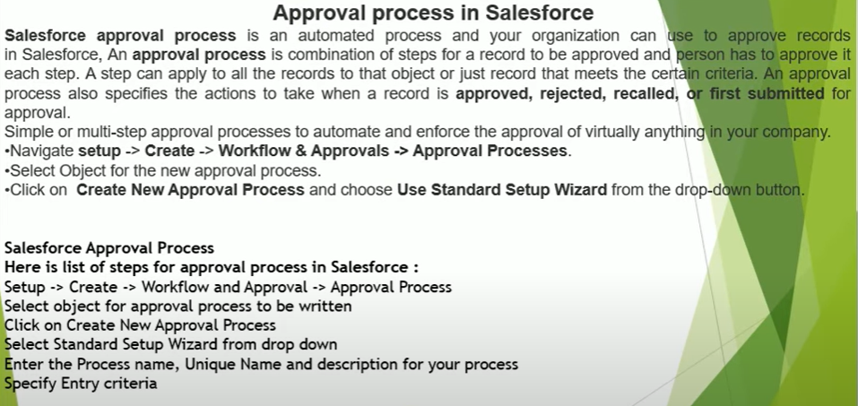

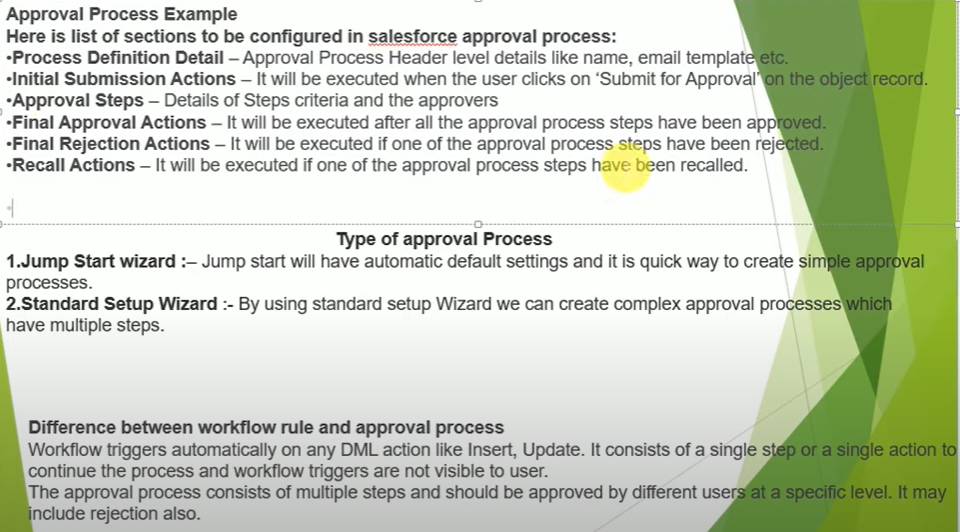

Approval processes are a type of workflow, which is any sequence of work from initiation to completion, that you can create to ensure work is approved the same way every time. Creating an approval process can simply mean defining the procedures that you will follow to approve work.

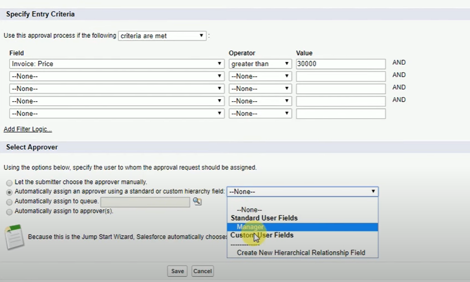

Integrate it in DevOps pipeline.

## Salesforce package

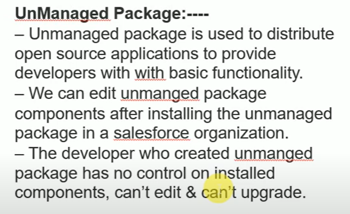

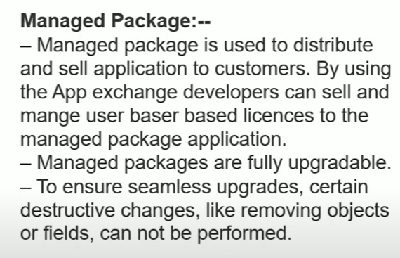

What is package in Salesforce

A package is a container for something as small as an individual component or as large as a set of related apps. After creating a package, you can distribute it to other Salesforce users and organizations, including those outside your company.

Packages come in two forms—unmanaged and managed:

Unmanaged packages

Unmanaged packages are typically used to distribute open-source projects or application templates to provide developers with the basic building blocks for an application. Once the components are installed from an unmanaged package, the components can be edited in the organization they are installed in. The developer who created and uploaded the unmanaged package has no control over the installed components, and can't change or upgrade them. Unmanaged packages should not be used to migrate components from a sandbox to production organization. Instead, use Change Sets.

As a best practice, install an unmanaged package only if the org used to upload the package still exists. If that org is deleted, you may not be able to install the unmanaged package.

Managed packages

NOTE Salesforce has two ways that you can build managed packages, first-generation packaging (1GP) and second-generation packaging (2GP). This guide describes 1GP. For new solutions, use 2GP as described in the Second-Generation Managed Packages section of the Salesforce DX Developer Guide.

Managed packages are typically used by Salesforce partners to distribute and sell applications to customers. These packages must be created from a Developer Edition organization. Using the AppExchange and the License Management Application (LMA), developers can sell and manage user-based licenses to the app. Managed packages are also fully upgradeable. To ensure seamless upgrades, certain destructive changes, like removing objects or fields, can not be performed.

Managed packages also offer the following benefits:

- Intellectual property protection for Apex
- Built-in versioning support for API accessible components
- The ability to branch and patch a previous version
- The ability to seamlessly push patch updates to subscribers
- Unique naming of all components to ensure conflict-free installs

## Salesforce vendors / tools

Provar is an end-to-end test automation solution designed especially for Salesforce. Provar comes as software that you install on a PC or Mac, with a Chrome application that lets you build Test Cases in the browser.

Gearset is the #1 solution for Salesforce DevOps, with deployments up to 12x faster than change sets. Featuring automation tools for CI/CD and data backup.

Copado is #1 Native DevOps tool for Salesforce that unites Admins, Architects and Developers on one platform.

## Salesforce DevOps

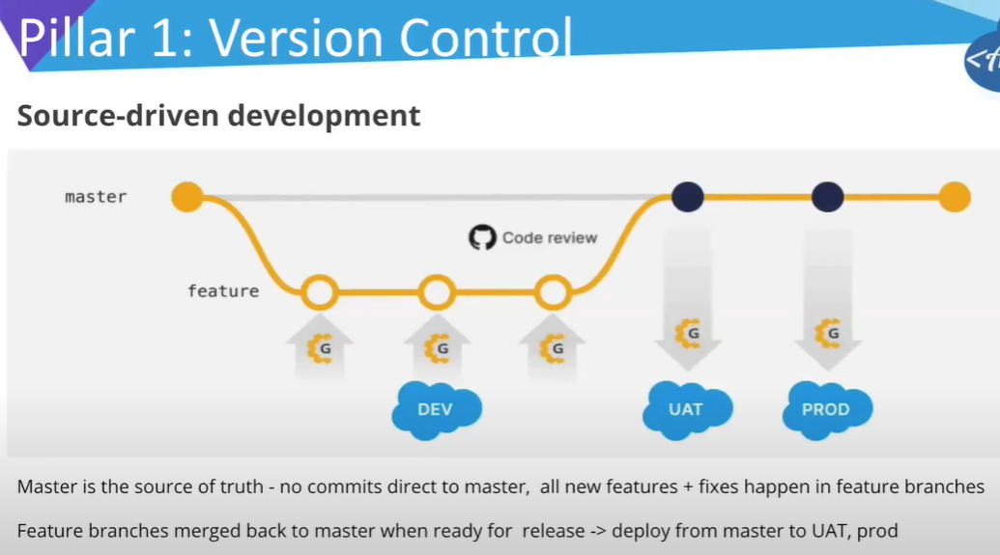

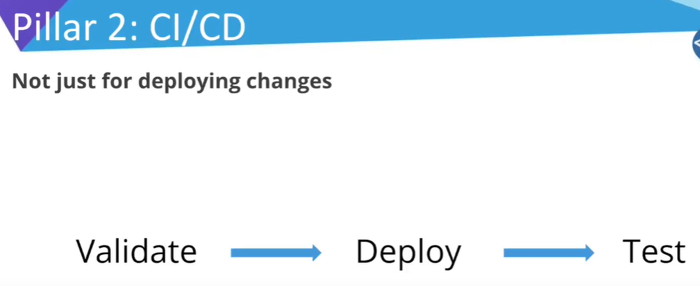

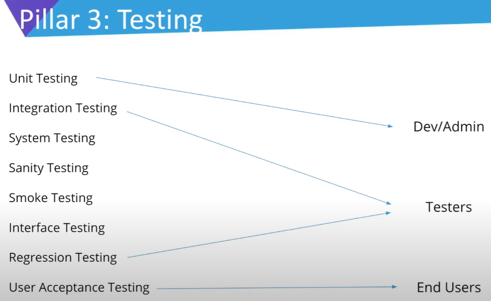

Test early and test often

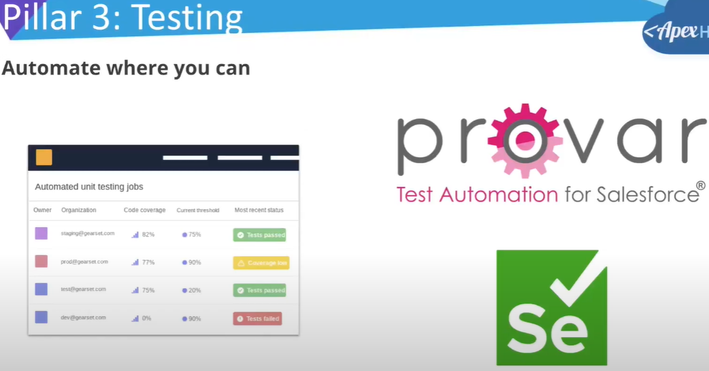

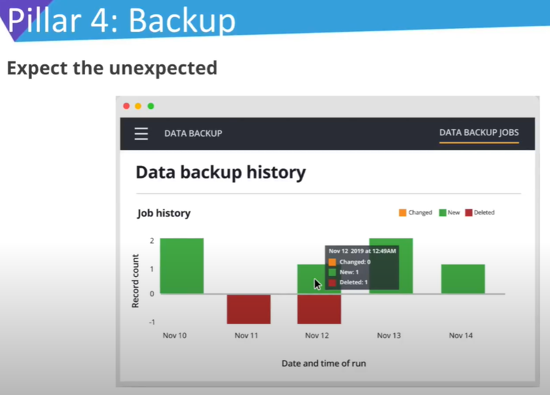

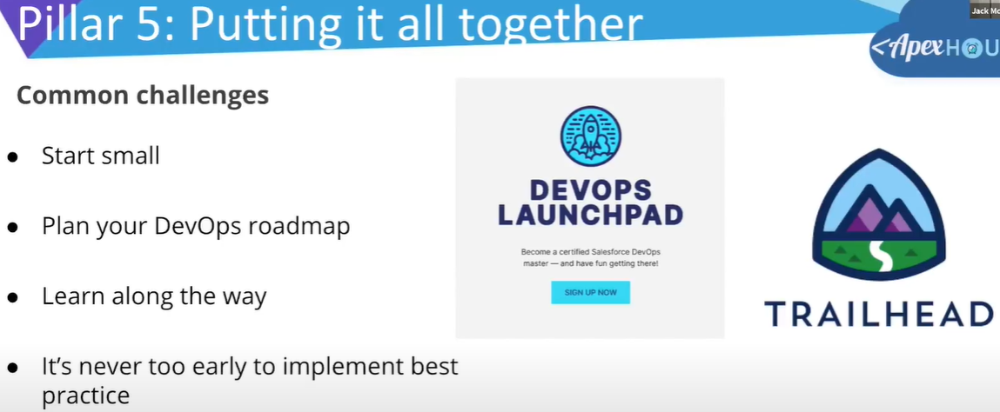

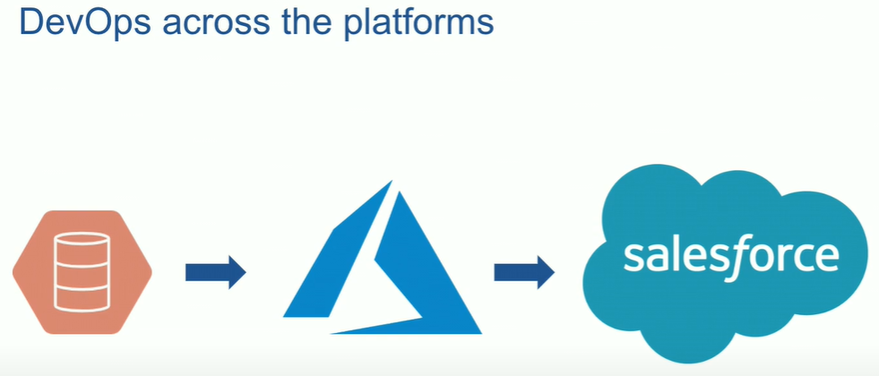

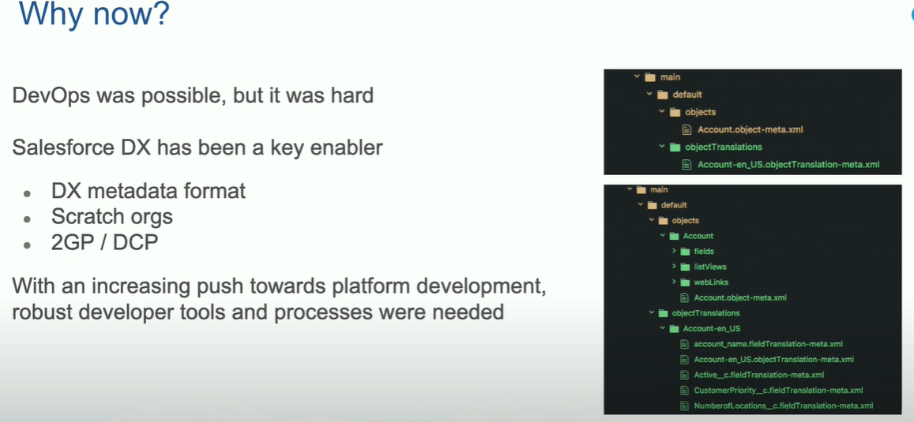

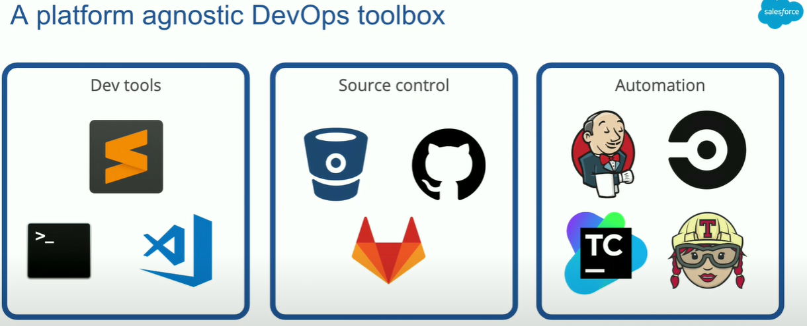

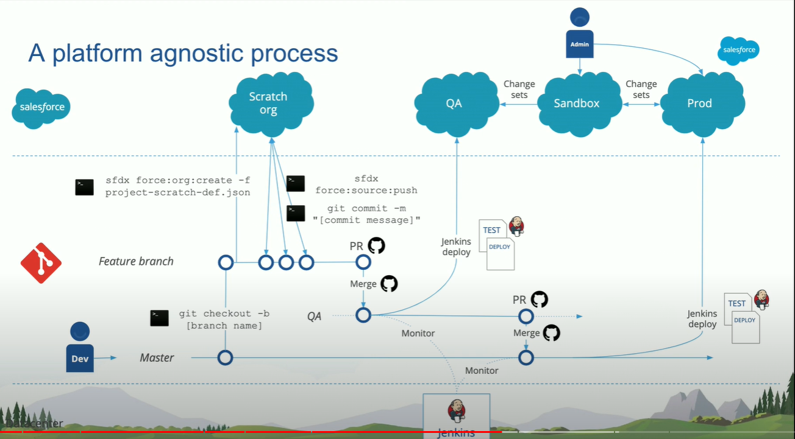

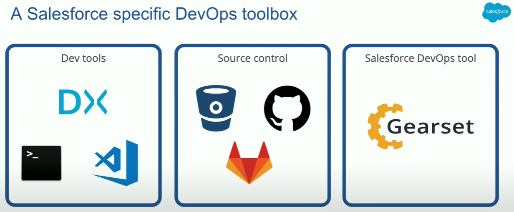

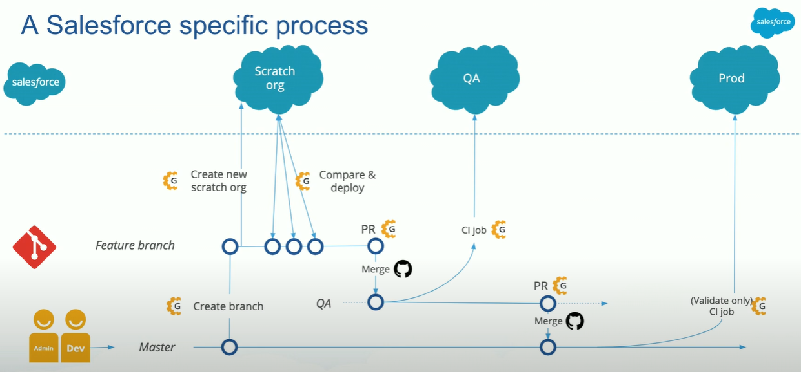

- DX metadata format
- Scratch orgs
- 2GP / DCP

## Salesforce + Azure DevOps

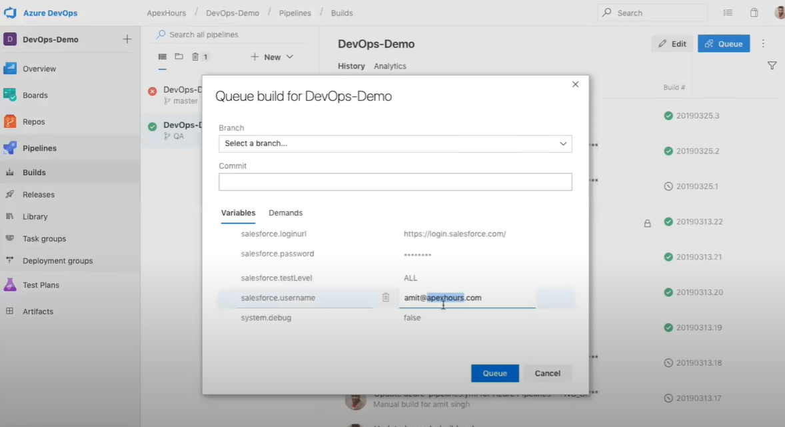

Ant is recommended in Azure DevOps pipeline.

Create a YAML file -

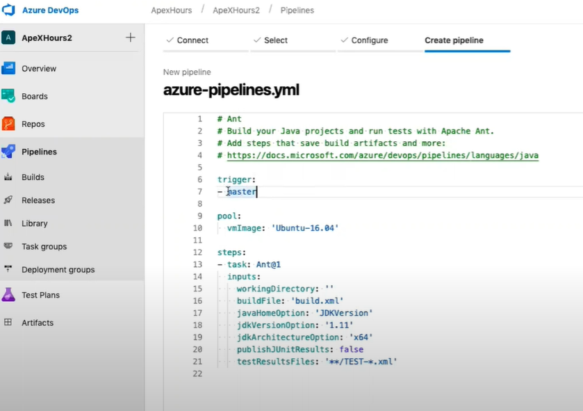

<http://github.com/amitastreait/DevOpsDemo>

## Salesforce Lightning Web Components (LWC)

Lightning Web Components (LWC) is a stack of modern lightweight frameworks built on the latest web standards. It is a DOM (Document Object Model), element created through reusable code and is used to generate a dynamic interface without using JavaScript or building a Library.

LWC is a new programming model to develop Salesforce lightning components. It's a UI framework that is built using native HTML and modern JavaScript.

## Salesforce Development Models

Salesforce Extensions for VS Code supports Org Development and Package Development models to authorize, create and switch orgs in your project:

Org Development Model: Allows you work with orgs that don’t have source tracking, such as sandbox, Developer Edition (DE) org, Trailhead Playground, or even a production org to retrieve and deploy code directly.
Package Development Model: Allows you to create self-contained applications or libraries that are deployed to your org as a single package. These packages are typically developed against source-tracked orgs such as scratch orgs. This development model uses org source tracking, source control, and continuous integration and deployment.

## Salesforce DX Project Configuration

sfdx-project.json

## Salesforce Package

If you're new to packaging, you can think about a package as a container that you fill with metadata. It contains a set of related features, customizations, and schema. You use packages to move metadata from one Salesforce org to another.

## Salesforce orgs

In Salesforce.com we have different types of organizations in salesforce.

Some of them are:

Production organization, sandbox organization, Developer organization, Partner Developer organization, Pre-Release Organization.
