# MySalesforce

For my Salesforce

## SFDX

Salesforce Extension Pack extension for VSCode

Salesforce CLI

Creating and managing metadata with CLI

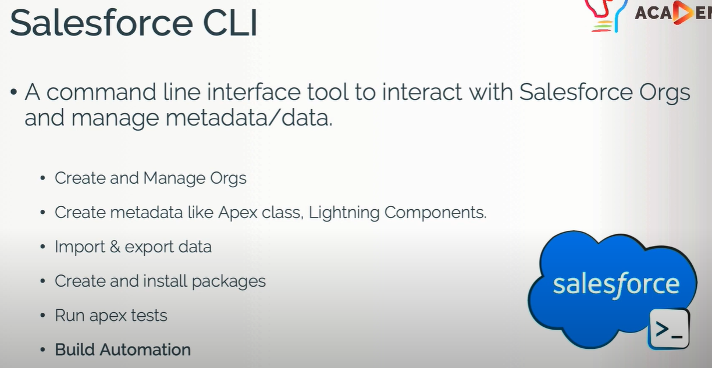

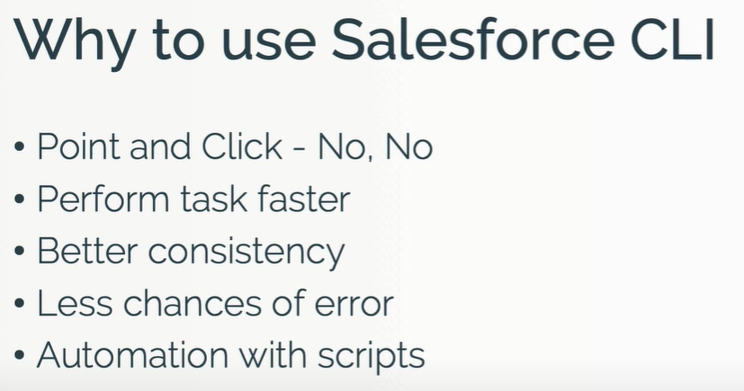

Classic mode vs Lighting mode

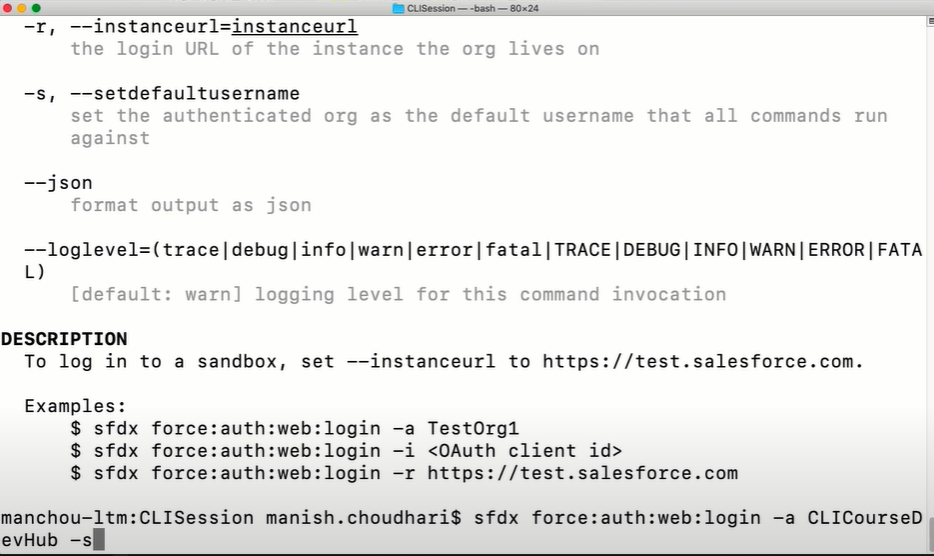

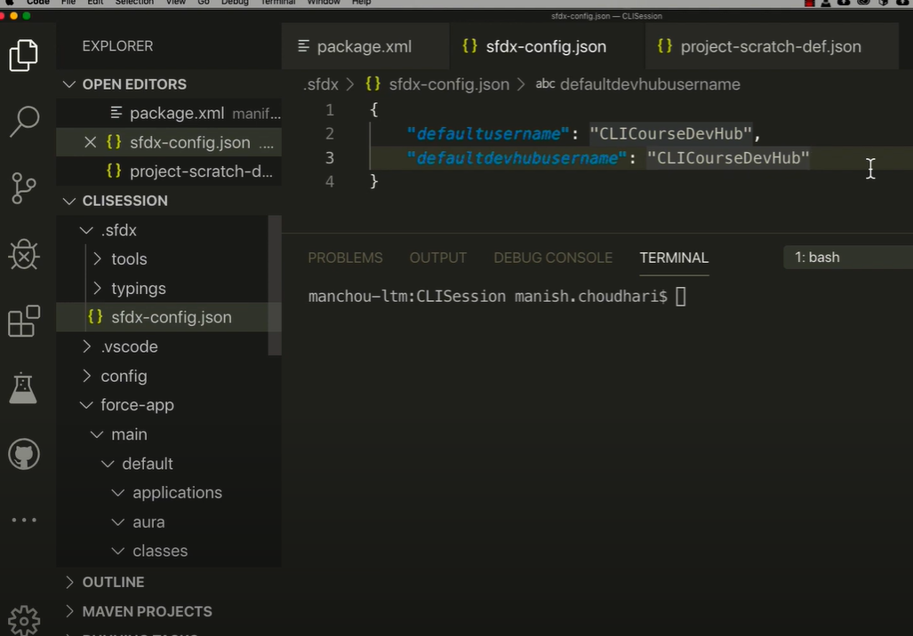

Retrieve Metadata From Salesforce Org to SFDX project Using CLI

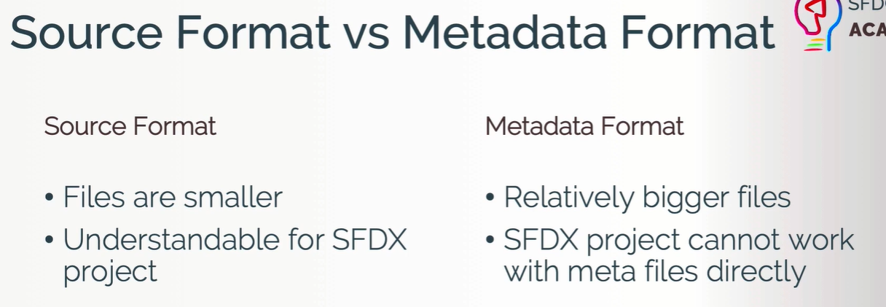

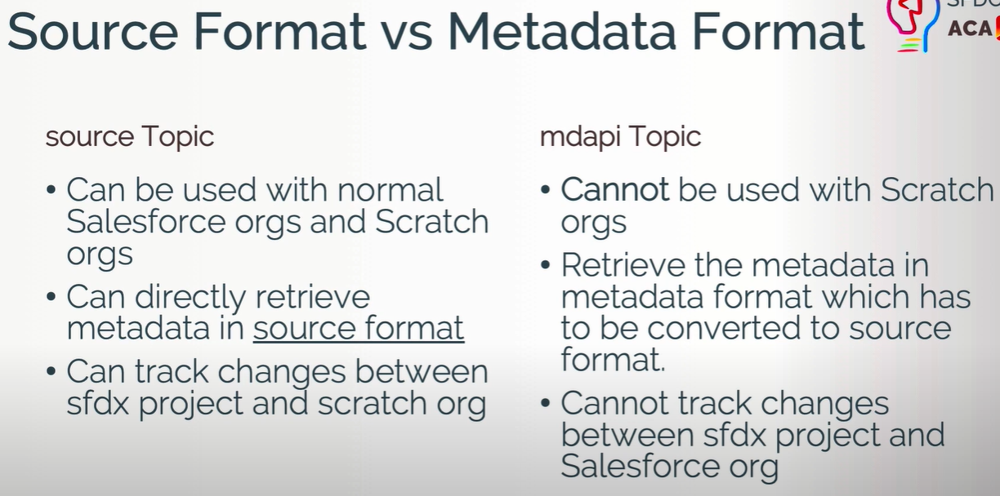

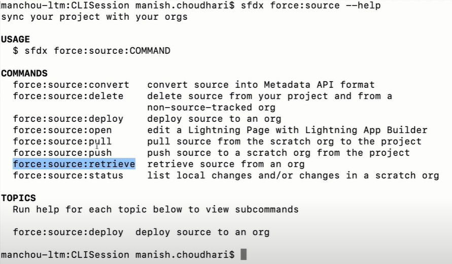

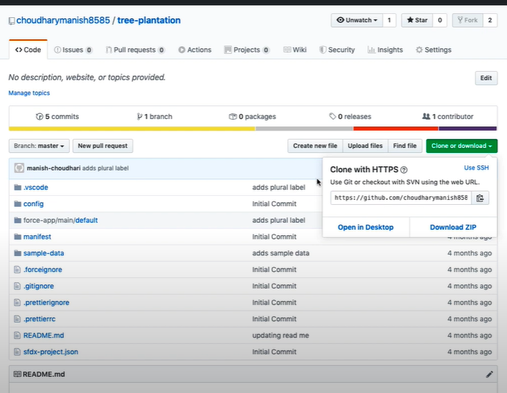

github.com/choudharymanish8585/tree-plantation

- Authorize a Salesforce org sfdx force:auth:web:login --setalias sfdxcourseorg --instanceurl https://login.salesforce.com --setdefaultusername

- Deploy the code sfdx force:source:deploy -p force-app/main/default

- Assign permission set sfdx force:user:permset:assign -n TreePlantation

- Open your Salesforce org sfdx force:org:open and explore the project

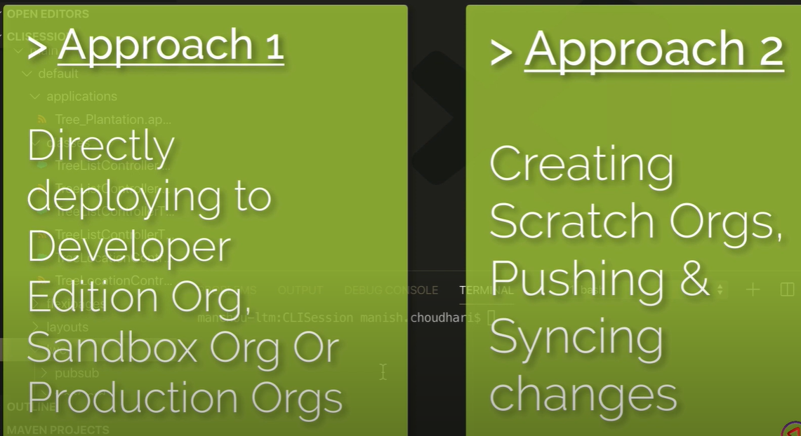

http://www.udemy.com/course/salesforce-cli/?couponCode=FEBDEAL

http://www.udemy.com/course/lightning-web-component-development/?couponCode=FEBDEAL

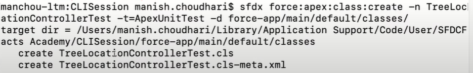

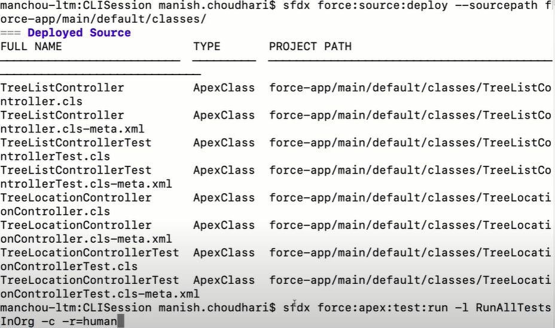

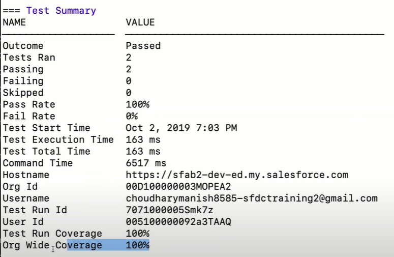

Query Salesforce Records from SFDX Using Salesforce CLI and SOQL

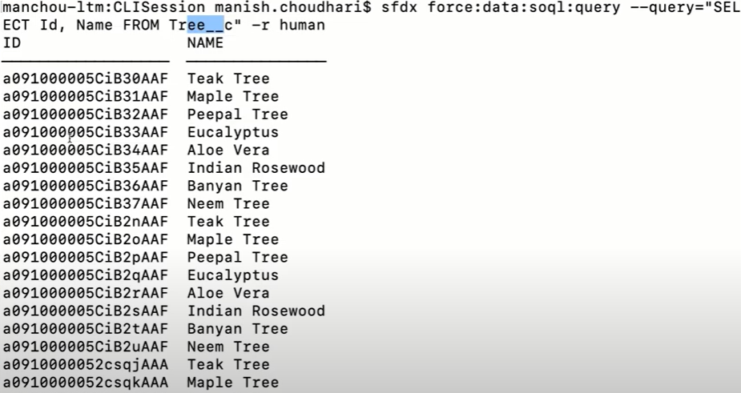

Create Update Delete (DML) in SFDX using Salesforce CLI

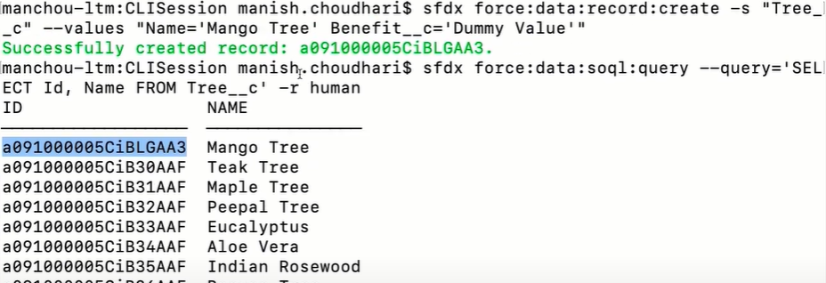

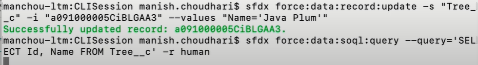

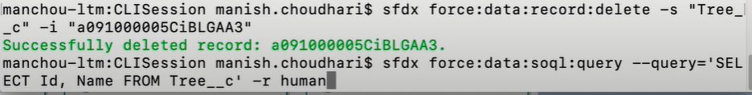

Create Scratch Orgs with Namespace | SFDX | Managed Package | Salesforce ISV Development
